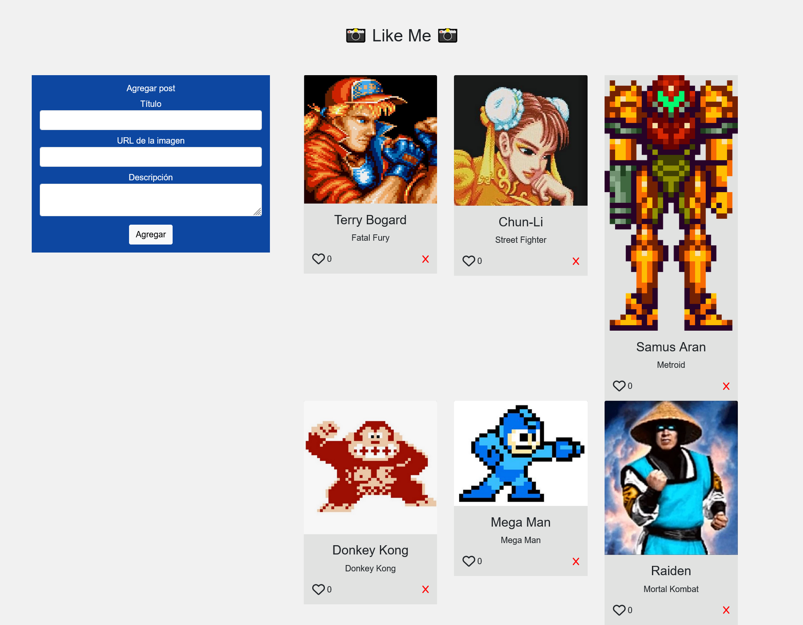

# Desafío - Like Me (Parte I) ❤️

En este desafío, he desarrollado una aplicación backend con Node.js y Express que gestiona los posts y los likes para la red social "Like Me".

## Descripción 📋

La red social "Like Me" está en proceso de desarrollo y busca enfocarse en los likes de los posts emitidos por los usuarios. En esta primera parte del desafío, se ha desarrollado la lógica correspondiente a la creación de posts.

### Captura de pantalla 📸



### Archivos del Proyecto 📂

- **index.js**: Archivo principal que importa las configuraciones de entorno y el servidor.
- **app.js**: Archivo principal del servidor que gestiona las rutas y las operaciones CRUD.
- **errors.js**: Archivo que contiene las validaciones de los campos de entrada.
- **db_connect.js**: Archivo que gestiona la conexión a la base de datos PostgreSQL.
- **posts.models.js**: Archivo que contiene las funciones para interactuar con la base de datos.

### Funcionalidades 🔧

- **Agregar Post**: Permite agregar un nuevo post a la base de datos.
- **Listar Posts**: Muestra todos los posts registrados en la base de datos.

## Requerimientos del Desafío 🎯

1. Habilitar los cors en el servidor utilizando el paquete de npm. (2 puntos)
2. Usar el paquete pg para conectarse e interactuar con la base de datos. (2 puntos)
3. Crear una ruta GET con Express para devolver los registros de una tabla alojada en PostgreSQL. (3 puntos)
4. Crear una ruta POST con Express que reciba y almacene en PostgreSQL un nuevo registro. (3 puntos)

## Uso de la Aplicación 🚀

### Instalación

Para instalar las dependencias y ejecutar la aplicación, utiliza los siguientes comandos:

```bash
npm install
npm run dev
```

### Endpoints

- POST /posts: Recibe los datos de un post y lo agrega a la base de datos.
- GET /posts: Devuelve un JSON con los posts registrados.

## Código 🧩

### index.js

```javascript
import 'dotenv/config'
import './src/server/app.js'
```

### app.js

```javascript
import express from 'express'
import cors from 'cors'

import { findAll, create } from './models/posts.models.js'
import { validateFields } from '../utils/errors.js'

const app = express()
const PORT = process.env.PORT ?? 3000

app.use(cors())
app.use(express.json())

app.get('/posts', async (req, res) => {
  try {
    const result = await findAll()
    res.status(200).json(result)
  } catch (error) {
    res.status(500).json({ status: false, message: `Ha ocurrido un error ${error}` })
  }
})

app.post('/posts', async (req, res) => {
  try {
    const { titulo, url, descripcion } = req.body

    const errors = validateFields({ titulo, url, descripcion })

    if (errors.length > 0) {
      return res.status(400).json({ status: false, errors })
    }

    const result = await create(titulo, url, descripcion)
    res.status(201).json(result)
  } catch (error) {
    res.status(500).json({ status: false, message: `Ha ocurrido un error ${error}` })
  }
})

app.all('*', (req, res) => res.status(400).json({ status: true, message: 'Endpoint no encontrado' }))

app.listen(PORT, () => { console.log(`Servidor funcionando en puerto: ${PORT}`) })
```

### errors.js

```javascript
export const validateFields = ({ titulo, url, descripcion }) => {
    const errors = []
    const imageUrlRegex = /^(http(s?):)([/|.|\w|\s|-])*\.(?:jpg|gif|png|jpeg|bmp|webp|svg|ico|tiff|tif|heic|heif)$/i

    if (!titulo || titulo.trim() === '') {
        errors.push({field: 'titulo', error: 'Campo requerido'})
    }

    if (!url || url.trim() === '') {
        errors.push({field: 'url', error: 'Campo requerido'})
    } else if (!imageUrlRegex.test(url)){
        errors.push({field: 'url', error: 'Formato de url no valido'})
    }

    if (!descripcion || descripcion.trim() === '') {
        errors.push({field: 'descripcion', error: 'Campo requerido'})
    }

    return errors
}
```

### db_connect.js

```javascript
import pg from 'pg'

const { Pool } = pg

const config = {
  user: process.env.DB_USER,
  password: process.env.DB_PASSWORD,
  host: process.env.DB_HOST,
  port: process.env.DB_PORT,
  database: process.env.DB_DATABASE,
  allowExitOnIdle: true
}

const pool = new Pool(config)

const db = async (query, values) => {
  try {
    const result = await pool.query(query, values)
    return result.rows
  } catch (error) {
    console.error('[db_connect] => db:', error)
    const newError = { status: false, message: error }
    throw newError
  }
}

export default db
```

### posts.models.js

```javascript
import db from '../database/db_connect.js'

export const findAll = async () => await db('SELECT * FROM posts')

export const create = async (titulo, url, descripcion) =>
  await db('INSERT INTO posts (titulo, img, descripcion) VALUES ($1, $2, $3) RETURNING *;', [titulo, url, descripcion])
```

## Tecnologías Utilizadas 💻

- Node.js
- Express.js
- PostgreSQL
- pg (node-postgres)

## Mejoras Futuras 🚀

Para futuras iteraciones, planeo:

- Implementar la funcionalidad de likes para los posts.
- Añadir autenticación y autorización de usuarios.
- Mejorar la validación y manejo de errores.
